# Cheatsheet Generator

> Transforms your application shortcuts into beautiful and comprehensive interactive graphics.

[Check out the demo on Zettlr's main website](https://zettlr.com/shortcuts)!

* Do you develop an application but tend to lose sight over the shortcuts you already built into your app?
* Do you use applications which feature a litany of different shortcuts and wished these could be displayed in a comprehensive cheatsheet?
* Or do you simply want to create a custom cheatsheet for your favourite game?

If you answered any of the above questions with "yes," then this package is for you!

It takes your shortcuts and creates a single-file cheatsheet which you can then either use locally, serve on your website, or even print out!

## Usage

First and foremost, you need to have **Node.js** installed on your computer. Optionally, make sure you got **Yarn**. Then either clone this repository, or download the ZIP file of it and extract it. Next, you need to install the dependencies (Webpack and YAML), so that building the maps works. Simply run `npm install` or `yarn install` in the directory to install them.

Then you can adapt the package and generate your own shortcuts. Simply copy the file `config.example.yml` to `config.yml` and add your shortcuts to it. Modify the settings if you wish. Finally, depending on whether you use NPM or Yarn, run `npm run build` or `yarn build`. The final cheatsheet will reside in `./build`.

Need some inspiration? Then head over to the `./examples`-directory and have a look at some settings that will out of the box generate beautiful cheatsheets.

## Motivation & Caveats

While thinking of new shortcuts to add for desperately needed commands for [my app](https://github.com/Zettlr/Zettlr), I realised that I actually have no idea of the ergonomics of the app's shortcuts. Plus, I didn't know which keys were already occupied. So I began the usual process of finding a solution in the form of a visual shortcut designer: Google, Stackoverflow, Reddit. After I didn't even find any useful SVG-images of keyboards to built upon, I decided to act and spent a weekend coding two keyboards and this small tool. What it does is neither new nor revolutionary, it is inspired by the attempts of some other developers to visualise the shortcuts for their apps. Specifically, I thought of [KotOR II](https://starwars.fandom.com/wiki/Star_Wars:_Knights_of_the_Old_Republic_II:_The_Sith_Lords), which came with a decent, high-quality printed cheatsheet back in the day.

However, this means:

* This tool is not designed to be used as an on-screen keyboard. You can certainly use it that way, but then the tool around the SVG-files won’t be necessary.
* I only included two keyboards, because you don't need more, and these were already hard to code (I wrote the SVG files by hand and decided against a dedicated app to maintain readability and DRY).
* "Why a Surface keyboard?" There's a litany of different keyboards out there, and when I have to decide, I use the one from the same company which makes the software for these keyboards in the first place. It should also work for Linux, because, you know, there's no such thing as dedicated linux keyboards (at least not well-known).
* ~~Keys that are secondary on certain keyboard layouts (that is, you need to press the Shift-key to reach it) are not supported. Use `Shift+<the default key>` instead.~~ Layer 2 and Layer 3 support is now available.

## Adding shortcuts

Adding shortcuts works by adding them as key:value-pairs to the config. Delimit them using plus-signs (+). You have the following special characters available:

- `Esc` or `Escape`
- `Option-Left`, `Option-Right`, shorthand: `Option` (falls back to option left)
- `Alt-Left`, `Alt-Right`, shorthand: ~~Libertarian nonsense~~ `Alt` (falls back to alt left)
- `CmdOrCtrl`, resolves to either `Cmd` (when selecting macOS from the platform dropdown) or `Ctrl` (for both Windows and Linux)
- `Comma`
- `Plus`
- `Minus`
- `F1` through `F12`
- `Arrow-Left`, `Arrow-Up`, `Arrow-Down`, and `Arrow-Right`, shorthands without "Arrow-"
- `Control`, shorthand `Ctrl`
- `Command`, shorthand `Cmd`
- `Shift-Left` and `Shift-Right`, shorthand: `Shift` (falls back to shift left)
- `Fn` (function key)
- `Windows`
- `Menu` (the menu key available, e.g., on the surface)
- `Tab`
- `Backspace`
- `Delete` (will fall back to `Backspace` on macOS!)
- `Space`
- `Special` (the special key in the top-right corner of macOS keyboards, mostly Eject or On/Off)

## License

The two SVG keyboards are licensed via **CC BY-NC-SA 4.0**, which means: You are allowed to modify and redistribute them, as long as you maintain a compatible license and make sure to attribute the author (that is: me). For more info, please have a look into the files, where all terms are conveyed. Additionally, [see the full and legally binding license text here](https://creativecommons.org/licenses/by-nc-sa/4.0/legalcode). Make sure you don't forget the license block in your derivatives.

The accompanying code is licensed via **GNU GPL v3**. Please see the LICENSE file for more information.
